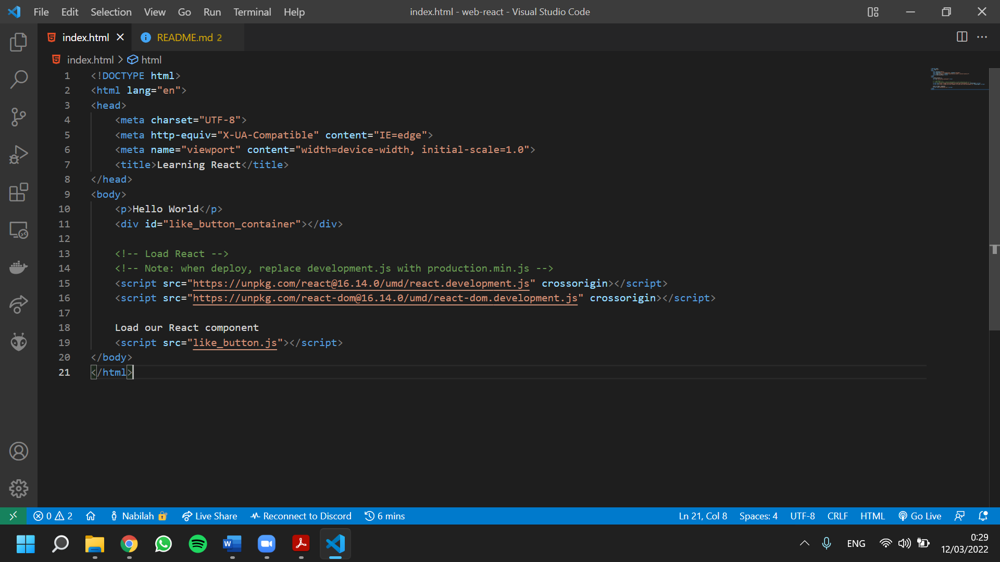
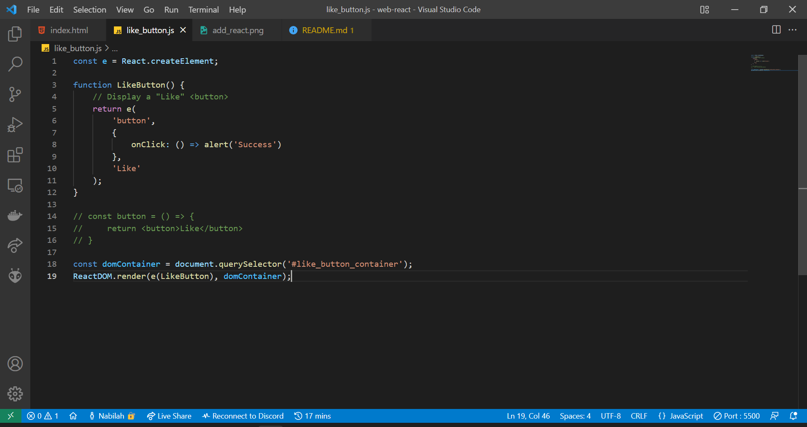
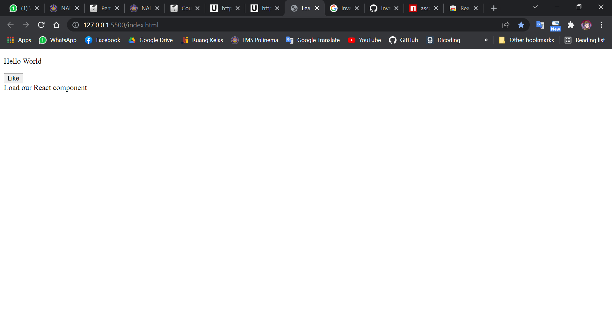
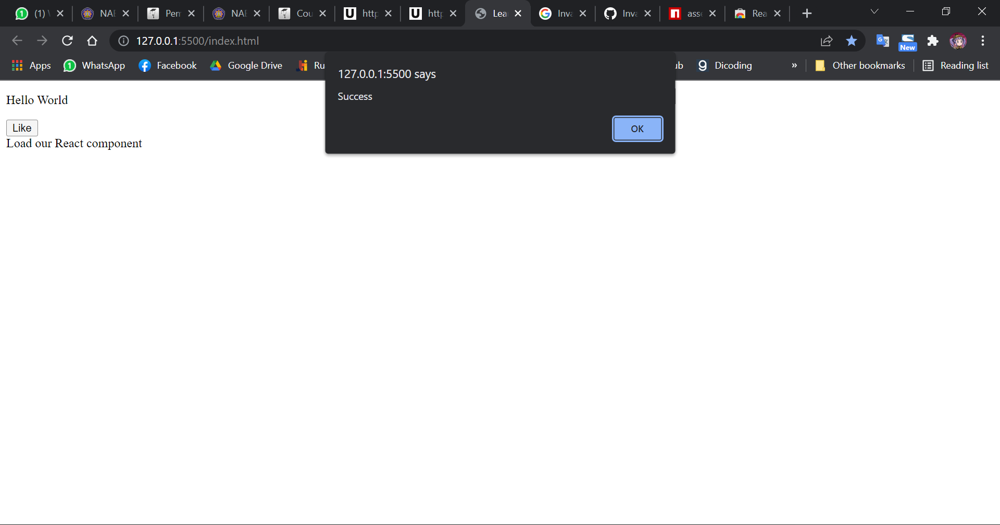
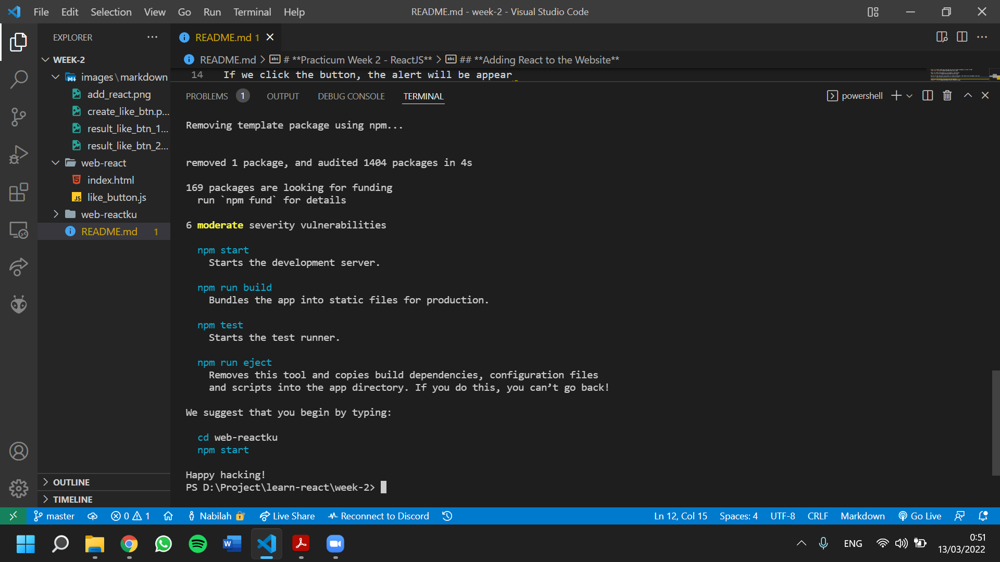
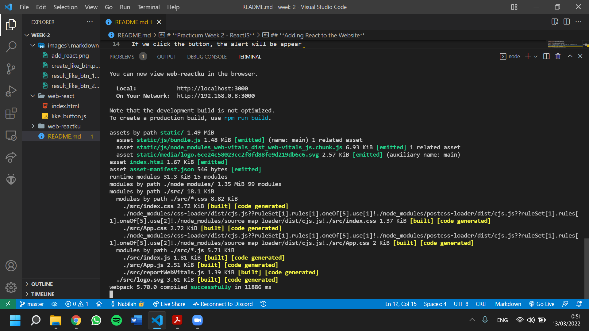
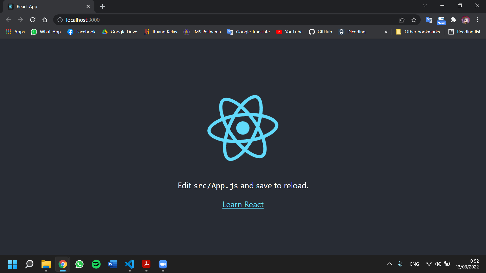
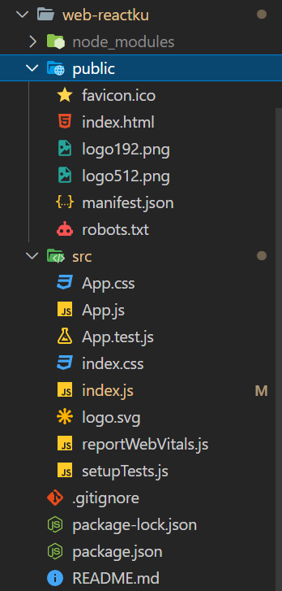
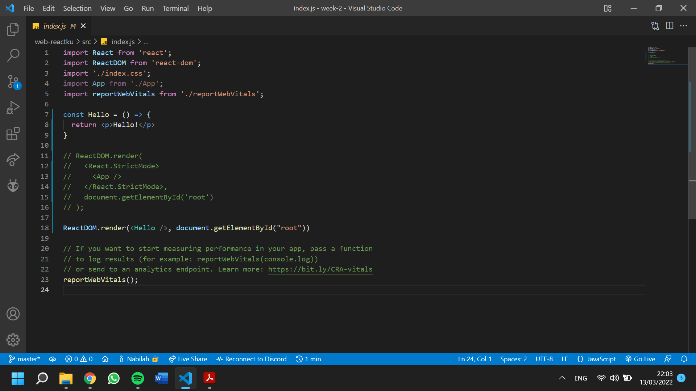
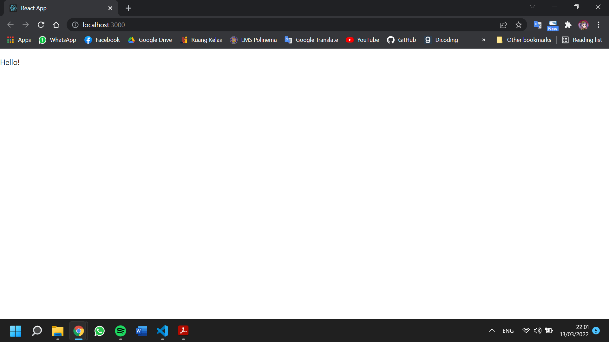

# **Practicum Week 2 - ReactJS**

## **Adding React to the Website**

First, we create index.html and add the link for React package on script in HTML.

Then, we create like_button.js to display a like button.

We can run the code with Live Server (or other extension). The result will be appear like this.

If we click the button, the alert will be appear.

## React-app Installation

First, we have to specify the location to install React. I'am using D:\Project\learn-react\week-2.

Next, we install ReactJS with `npm install -g create-react-app` and we can continue to create project with `create-react-app web-reactku`.

To launch the website, we can change the directory first with `cd web-reactku` and then type `npm start`.

## React Project Structure

After we create new project, we will have the file structure like this.

The are 3 main folders, namely:

* node_modules: to save the library from node
* public: to save resource
* src: to doing some code

## Creating Hello Components Using Arrow Function

First, we have to modify the code in src/index.js. Add arrow function Hello to return a HTML contain paragraph and render it with ReactDOM to `id=root`.

If we have run `npm start` before, we don't have to do it again because React have auto refresh the browser and we can check the result directly.

